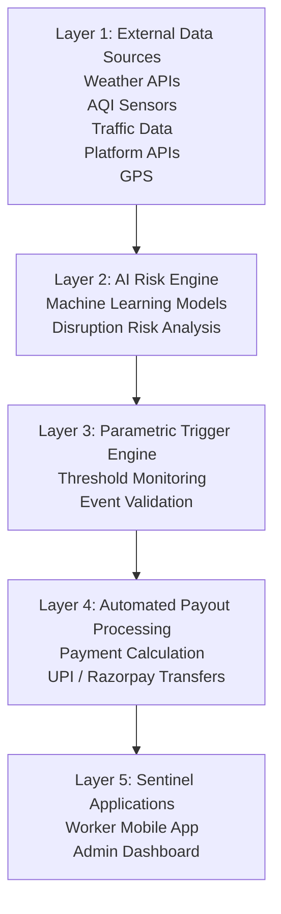
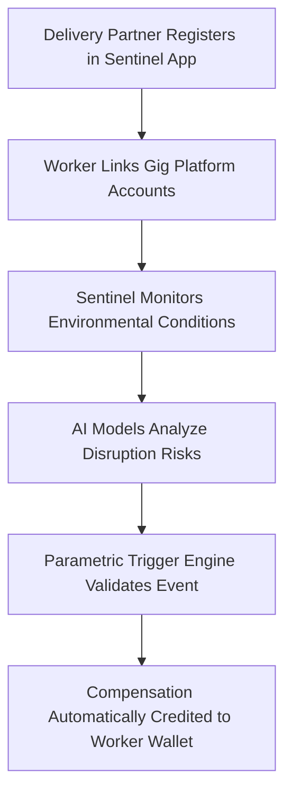

# 🚀 Sentinel

### AI-Powered Predictive Income Protection for Gig Delivery Workers

---

💡 **Sentinel** is an AI-driven platform designed to protect gig delivery workers from **income loss caused by environmental disruptions** such as rain, heatwaves, and pollution.

The system combines **machine learning, environmental monitoring, and automated parametric insurance payouts** to provide financial protection for delivery partners working across multiple gig platforms.

---

# 👥 Team Members & Contributions

| 👤 Team Member | 🎯 Role | 💫 Contribution |
|---------------|--------|----------------|
| **Sankurathri Saketh** | 🧑‍💼 **Team Lead & Data Strategy Analyst** | Led overall project planning and coordination, defined the project roadmap, supervised team collaboration, and contributed to analyzing environmental and platform data requirements for the Sentinel system. |
| **Gourishetti Ruthvik** | 🚀 **Lead Software Developer** | Implemented core application logic, developed backend services and integration modules, managed the project repository, and ensured seamless connectivity between system components. |
| **G. Sai Pradhun** | 🏗️ **System Architect** | Designed the Sentinel system architecture, planned the layered service structure, defined module interactions, and ensured scalability and modular development across the platform. |
| **Girish Gautam Vinodh Kumar** | 📄 **Technical Documentation & Quality Assurance Engineer** | Prepared detailed project documentation including README and system descriptions, validated documentation accuracy, assisted in testing workflows, and ensured clarity and consistency across project materials. |
| **Bangaru Naga Venkata Yuva Nandan** | 🤖 **AI & Machine Learning Engineer** | Developed and tested AI/ML components for disruption risk prediction, implemented machine learning models, and supported model evaluation and experimentation for system intelligence. |

---

# 📄 1. Abstract

Substantial employment opportunities have been created in the Indian gig economy with the establishment of digital delivery platforms such as Swiggy, Zomato, Amazon, Blinkit, and Zepto. These platforms utilize a large workforce by allocating tasks among delivery partners, who mostly work as independent contractors and are paid according to the tasks performed for these platforms. Even though this has created new employment opportunities for the Indian populace, employees have become vulnerable to economic volatility due to external factors.

Environmental factors such as rainfall, air quality, extreme temperatures, and storms, as well as social factors such as unplanned curfews, local strikes, and closure of market zones, have become common causes of disruptions for these platforms in Indian cities, thereby reducing the tasks performed by these employees and consequently their earnings due to reduced access to pickup and drop-off locations. Employees of these platforms mostly work as independent contractors and are not entitled to any benefits such as paid leaves and insurance during periods of reduced income.

To address the issues being experienced by platform workers within the city of Bengaluru, the present project proposes the development of a predictive income protection platform named **Sentinel**.

The platform is expected to provide workers with the required benefits in response to reduced income due to environmental and social disruptions. The platform will provide benefits according to a parametric insurance model. The platform will integrate various data sources, including meteorological stations, air quality stations, geolocation, and real-time social event feeds.

Machine learning will be used to assess the risk level of various disruptions, both environmental and social. The platform will provide workers with required benefits once triggers have been activated.

In addition to the aforementioned functionality, the platform will be a multi-platform solution that provides a single unified system for income protection for delivery partners using multiple applications. It ensures seamless integration across platforms and delivers cohesive benefits.

The platform will also introduce a **weekly micro-premium model**, allowing workers to make small, manageable payments aligned with their weekly earnings.

The present solution is highly relevant within the modern gig economy.

# ⚠️ 2. Problem Statement

Major gig platforms operating in India include:

| Platform | Category            |
| -------- | ------------------- |
| Swiggy   | Food Delivery       |
| Zomato   | Food Delivery       |
| Zepto    | Quick Commerce      |
| Blinkit  | Quick Commerce      |
| Amazon   | E-commerce Delivery |
| Flipkart | E-commerce Delivery |

These companies employ **millions of delivery partners** across cities such as:

* Mumbai
* Delhi
* Bangalore
* Chennai

Despite being essential to the digital economy, gig workers operate as **independent contractors**, meaning they receive **no financial protection during disruptions**.

---

### 🌧️ Examples of Environmental Disruptions

| City      | Disruption           | Impact                  |
| --------- | -------------------- | ----------------------- |
| Mumbai    | Flooding             | Delivery routes blocked |
| Delhi     | Severe air pollution | Outdoor work restricted |
| Chennai   | Cyclonic weather     | Logistics disruptions   |
| Bangalore | Heavy rainfall       | Reduced delivery demand |

Even short disruptions can significantly impact workers' **weekly income cycles**.

---

### ❗ Limitations of Existing Insurance Products

| Limitation                   | Description                                   |
| ---------------------------- | --------------------------------------------- |
| Complex Claims               | Require documentation and manual verification |
| Inflexible Policy Structures | Do not match gig worker earnings              |
| Income Recognition Issues    | Gig income often not considered insurable     |

This results in a **major uninsured income gap** in the gig economy.

---

# 💡 3. Proposed Solution

Sentinel is an **AI-powered parametric insurance platform** that provides automated income protection for gig delivery workers.

The platform continuously monitors environmental conditions and automatically compensates workers when disruption thresholds are exceeded.

---

### 🎯 Key Objectives

| Objective                | Description                                         |
| ------------------------ | --------------------------------------------------- |
| Automated Protection     | Financial protection without manual claims          |
| Environmental Monitoring | Real-time detection of disruptions                  |
| AI Risk Prediction       | Machine learning estimates disruption probabilities |
| Parametric Triggers      | Automated payout activation                         |
| Multi-Platform Support   | Works across multiple gig delivery apps             |

---

### 📊 Environmental Data Monitored

* Rainfall intensity
* Air quality levels
* Temperature extremes
* Disaster alerts

Machine learning models analyze these signals to detect disruptions and activate **automated compensation**.

---

# 🏗️ 4. System Architecture

The Sentinel platform follows a **layered architecture design**.

This modular architecture allows **independent services and scalable deployment**.

---

# ⚡ 5. Parametric Disruption Triggers

# Low-Risk Zone Triggers (0.8× Multiplier)

Regions: Rajasthan, Delhi, Madhya Pradesh, Uttar Pradesh

| Trigger | Data Source | Threshold Condition | Payout Rule | Fraud Validation | Coverage / Plans |
|--------|-------------|--------------------|-------------|------------------|------------------|
| **Heavy Rain / Flood Alert** (Environmental) | IMD Open Data API + District Flood Warning System | Rainfall exceeds IMD Orange Alert threshold or district flood warning issued in worker’s zone | Full-day income replacement for each day the alert remains active | Worker GPS confirms presence within alert zone and delivery volume significantly drops | Wanderer ₹23/wk (net ₹0)   Guardian ₹47/wk (net ₹0)   Vanguard ₹79/wk (net ₹9)   Sentinel ₹119/wk (net ₹49) |
| **Extreme Heat Wave** (Environmental) | IMD Heatwave Advisory + OpenWeatherMap | Temperature exceeds safe outdoor limits and official heatwave advisory is active | Half-day income replacement during peak heat hours | Worker must be active during delivery hours and GPS confirms presence in heat zone | Wanderer ₹23/wk (net ₹0)   Guardian ₹47/wk (net ₹0)   Vanguard ₹79/wk (net ₹9)   Sentinel ₹119/wk (net ₹49) |
| **Hazardous AQI Event** (Environmental) | CPCB National AQI + Government GRAP advisory | AQI crosses hazardous level and outdoor work restrictions are issued | Full-day income replacement for AQI day events | Delivery volume reduction verified across platforms and validated with CPCB AQI readings | Vanguard ₹79/wk (net ₹9)   Sentinel ₹119/wk (net ₹49) |
| **Social Disruption** (Social) | Government advisory feeds + district announcements | Curfew, bandh, or Section 144 order confirmed in worker’s district | Hourly income replacement during disruption window | Event verified using NLP from official announcements and GPS confirmation of worker location | Vanguard ₹79/wk (net ₹9)   Sentinel ₹119/wk (net ₹49) |
| **Platform Delivery Blackout** (Platform) | Platform API health monitor + outage tracking system | Delivery app outage exceeding two hours in worker’s zone | Hourly income replacement up to six hours per incident | Worker GPS confirms presence and peer delivery activity shows zero orders | Sentinel ₹119/wk (net ₹49) |

# High-Risk Zone Triggers (1.4× Multiplier)

Regions: Mumbai, Kolkata, Chennai, Kerala, Assam

| Trigger | Data Source | Threshold Condition | Payout Rule | Fraud Validation | Coverage / Plans |
|-------|-------------|--------------------|------------|-----------------|----------------|
| **Heavy Rain / Flood Alert** (Environmental) | IMD Open Data API + District Flood Warning System | Rainfall exceeds IMD Orange Alert threshold or district flood warning issued in worker’s zone | Full-day income replacement for each day the alert remains active | Worker GPS confirms presence within alert zone and delivery volume significantly drops | Wanderer ₹41/wk (net ₹0)   Guardian ₹83/wk (net ₹13)   Vanguard ₹139/wk (net ₹69)   Sentinel ₹209/wk (net ₹139)   Paragon ₹279/wk (high only) |
| **Extreme Heat Wave** (Environmental) | IMD Heatwave Advisory + OpenWeatherMap | Temperature exceeds safe outdoor limits and official heatwave advisory is active | Half-day income replacement during peak heat hours | Worker must be active during delivery hours and GPS confirms presence in heat zone | Wanderer ₹41/wk (net ₹0)   Guardian ₹83/wk (net ₹13)   Vanguard ₹139/wk (net ₹69)   Sentinel ₹209/wk (net ₹139)   Paragon ₹279/wk (high only) |
| **Hazardous AQI Event** (Environmental) | CPCB National AQI + Government GRAP advisory | AQI crosses hazardous level and outdoor work restrictions are issued | Full-day income replacement for AQI day events | Delivery volume reduction verified across platforms and validated with CPCB AQI readings | Vanguard ₹139/wk (net ₹69)   Sentinel ₹209/wk (net ₹139)   Paragon ₹279/wk (high only) |
| **Social Disruption** (Social) | Government advisory feeds + district announcements | Curfew, bandh, or Section 144 order confirmed in worker’s district | Hourly income replacement during disruption window | Event verified using NLP from official announcements and GPS confirmation of worker location | Vanguard ₹139/wk (net ₹69)   Sentinel ₹209/wk (net ₹139)   Paragon ₹279/wk (high only) |
| **Platform Delivery Blackout** (Platform) | Platform API health monitor + outage tracking system | Delivery app outage exceeding two hours in worker’s zone | Hourly income replacement up to six hours per incident | Worker GPS confirms presence and peer delivery activity shows zero orders | Sentinel ₹209/wk (net ₹139)   Paragon ₹279/wk (high only) |

# 🧠 6. AI and Machine Learning Components

| Component | Technology | Function (with more description) |
|-----------|-----------|-----------------------------------|
| Risk Prediction | LSTM Time-Series Models | Forecast environmental disruptions by learning patterns in past weather and pollution data, so the system can warn when delivery work is likely to be affected. |
| Fraud Detection | Anomaly Detection Models | Identify suspicious activities by spotting behaviour that looks very different from normal payouts or worker activity, helping block fake or dishonest claims. |
| Premium Pricing | Gradient Boosted Trees | Calculate dynamic premiums by studying risk factors (city, season, disruption history) and setting fair weekly prices for different workers and zones. |
| Zone Classification | ML Risk Models | Categorize delivery zones by risk level (low, medium, high) based on historical disruption data, so high-risk areas get stronger monitoring and protection. |

# 🔄 7. Application Workflow

---

# 💰 8. Weekly Premium Model
# Sentinel Insurance Plans

## Low-Risk Zone (0.8× Multiplier)

Regions: Rajasthan, Delhi, Madhya Pradesh, Uttar Pradesh

| Plan Name | Tier | Weekly Premium | Net Weekly Cost | Max Weekly Payout | Coverage |
|-----------|------|---------------|-----------------|------------------|----------|
| **Wanderer** | Basic | ₹23/week (₹29 × 0.8) | ₹0/week after ₹70 deduction | ₹300 | Rain and storm |
| **Guardian** | Plus | ₹47/week (₹59 × 0.8) | ₹0/week after ₹70 deduction | ₹700 | Rain and pollution |
| **Vanguard** | Pro | ₹79/week (₹99 × 0.8) | ₹9/week after ₹70 deduction | ₹1,100 | Multi-trigger |
| **Sentinel** | Pro+ | ₹119/week (₹149 × 0.8) | ₹49/week after ₹70 deduction | ₹2,500 | Comprehensive |

**Note:**  
Low-risk zones include four plans: Wanderer → Guardian → Vanguard → Sentinel.  
Workers receive a **0.8× multiplier discount** on all base premiums.

---

# High-Risk Zone (1.4× Multiplier)

Regions: Mumbai, Kolkata, Chennai, Kerala, Assam

| Plan Name | Tier | Weekly Premium | Net Weekly Cost | Max Weekly Payout | Coverage |
|-----------|------|---------------|-----------------|------------------|----------|
| **Wanderer** | Basic | ₹41/week (₹29 × 1.4) | ₹0/week after ₹70 deduction | ₹300 | Rain and storm |
| **Guardian** | Plus | ₹83/week (₹59 × 1.4) | ₹13/week after ₹70 deduction | ₹700 | Rain and pollution |
| **Vanguard** | Pro | ₹139/week (₹99 × 1.4) | ₹69/week after ₹70 deduction | ₹1,400 | Multi-trigger |
| **Sentinel** | Pro+ | ₹209/week (₹149 × 1.4) | ₹139/week after ₹70 deduction | ₹2,500 | Comprehensive |
| **Paragon** | Ultra | ₹279/week (₹199 × 1.4) | ₹209/week after ₹70 deduction | ₹4,000 | Flood, storm, pollution & evacuation |

**Note:**  
High-risk zones include five plans: Wanderer → Guardian → Vanguard → Sentinel → Paragon.  
The **Paragon (Ultra)** plan is available only in extreme flood, storm, and pollution-prone regions.
---

# ⚙️ 9. Technology Stack

| Technology        | Category         | Purpose                               |
| ----------------- | ---------------- | ------------------------------------- |
| PyTorch           | AI Framework     | Weather prediction models             |
| TensorFlow        | AI Framework     | Income drop detection                 |
| LangChain         | AI Orchestration | Decision automation                   |
| Pinecone          | Vector Database  | Worker embeddings & similarity search |
| React + Next.js   | Frontend         | Dashboard & worker interface          |
| FastAPI           | Backend API      | Model serving                         |
| OpenAI Embeddings | AI Embeddings    | Vector representation                 |
| Docker            | Containerization | Deployment portability                |
| Tailwind CSS      | UI Framework     | Responsive interface                  |

---

# 🌍 10. Expected Impact

Sentinel introduces a **transformative financial safety net** for millions of gig delivery workers who remain vulnerable to income loss caused by environmental and social disruptions — delivering fast, fair, and fully automated protection.

---

### Core Impact Areas

| 🏷️ Impact Area | 💡 Benefit | 📈 Expected Outcome |
|----------------|-----------|---------------------|
| **Worker Financial Security** | Protects weekly income during rain, heatwaves, AQI events, and social disruptions | Workers no longer face zero-income weeks due to factors beyond their control |
| **Instant Automated Compensation** | Eliminates manual insurance claims and paperwork entirely | Payouts credited directly to worker wallet within minutes of trigger activation |
| **Multi-Platform Unified Coverage** | Single Sentinel subscription covers income loss across Swiggy, Zomato, Blinkit, Zepto, Amazon, and Flipkart | Workers gain seamless protection regardless of which platforms they use |
| **AI-Driven Risk Intelligence** | LSTM and Gradient Boosted models continuously predict disruption risk before events occur | Proactive alerts and dynamic pricing that adapts to seasonal and regional risk patterns |
| **Scalable Social Infrastructure** | Modular architecture can onboard millions of gig workers across Indian cities | Platform scales from Tier-1 cities to smaller towns as gig economy expands |
| **Fraud-Resistant Payouts** | GPS verification, peer delivery activity tracking, and anomaly detection models validate every claim | Ensures fair disbursement while protecting the insurance pool from misuse |
| **Flexible Micro-Premium Model** | Weekly premiums starting as low as ₹23/week — aligned with gig workers' weekly earnings cycle | Removes the barrier of large annual premiums that are unaffordable for daily-wage earners |
| **Zone-Aware Risk Pricing** | Low-risk and high-risk zone multipliers (0.8× and 1.4×) ensure geographically fair pricing | Workers in flood-prone cities like Mumbai and Chennai get stronger coverage at justified rates |

---

### 📊 Scale of Addressable Impact

| Metric | Estimate |
|-----------|------------|
| Gig delivery workers in India (2024) | **~15 Million+** |
| Workers currently without income protection | **~90%** |
| Cities targeted in Phase 1 | Bengaluru, Mumbai, Delhi, Chennai, Kolkata |
| Platforms integrated | Swiggy, Zomato, Blinkit, Zepto, Amazon, Flipkart |
| Minimum weekly premium (Low-Risk Zone) | ₹23/week (Net ₹0 after platform deduction) |
| Maximum weekly payout (High-Risk Zone) | ₹4,000/week (Paragon Plan) |

---

### Why Sentinel Matters

> *"Gig workers power India's digital economy — yet they are the least protected when it breaks down."*

By combining **predictive AI, real-time environmental monitoring, parametric triggers, and instant UPI payouts**, Sentinel closes the **most critical uninsured gap** in India's gig economy — delivering compensation that is:

**Automatic** — no claims, no paperwork  
**Transparent** — trigger conditions are pre-defined and verifiable  
**Affordable** — micro-premiums deducted weekly from platform earnings  
**Inclusive** — accessible to workers on any gig platform across India  

---

